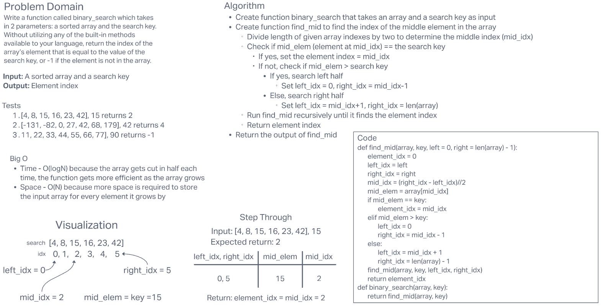

# **Array Binary Search**

This challenge required us to create a function that returns the index of an element in an array that matches matches a search key, without using any built-in Python methods.

## **Whiteboard Process**

