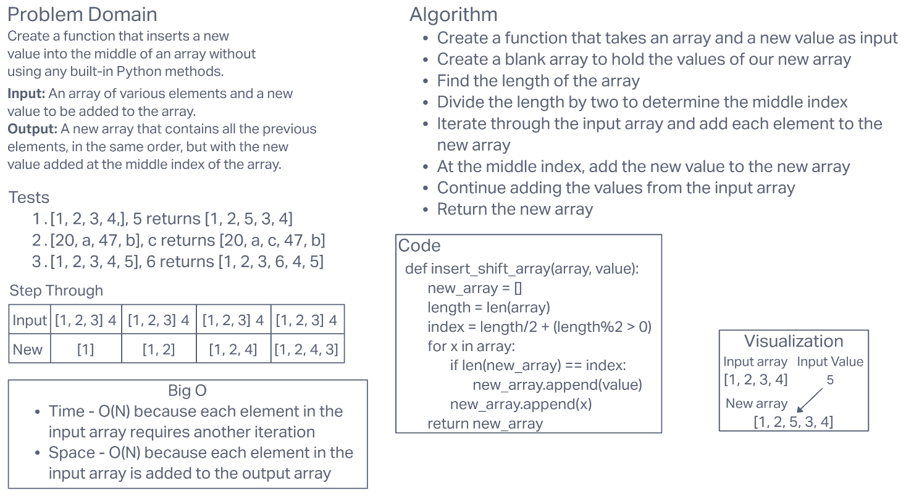

# **Array Insert Shift**

This challenge required us to create a Python function that will add a new value to the middle of an array without using any built-in Python methods.

## **Whiteboard Process**

