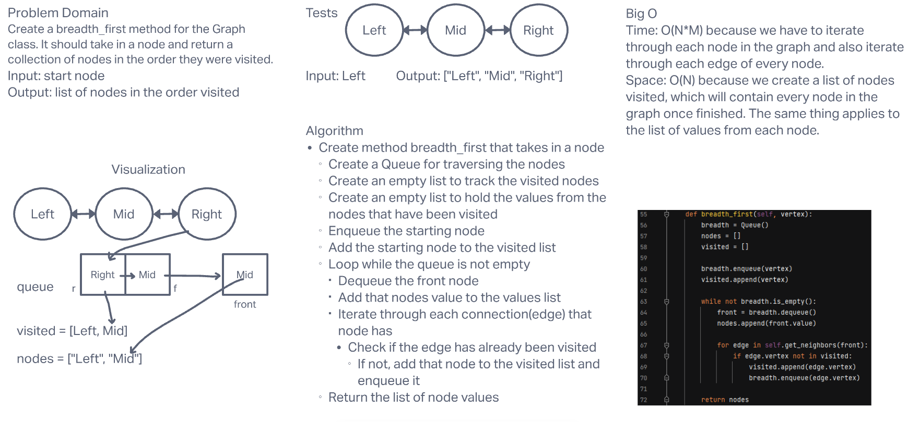

# **Challenge Summary**

This challenge required us to add the method `breadth_first` to our existing Graph class. This method should take in a node to start the search from and return a list of nodes in the order they were visited.

## **Whiteboard Process**

## **Approach & Efficiency**

Big O Time: I believe it is O(N*M) because we have to iterate through each node in the graph and also iterate through each edge of every node.

Big O Space: I believe it is O(N) because we create a list of nodes visited, which will contain every node in the graph once finished. The same thing applies to the list of values from each node.
