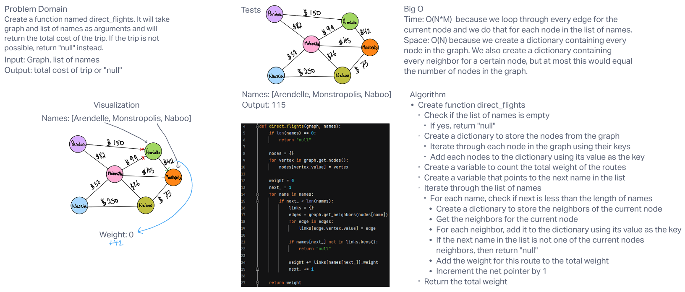

# **Challenge Summary**

This challenge required us to create a business_trip function that takes a graph and list of names as arguments. It check if the names in the list are reachable from the previous node in the list and then return the total cost of the trip for all nodes visited.

## **Whiteboard Process**

## **Approach & Efficiency**

Big O Time: I believe it is O(N*M) because we loop through every edge of the current node and we do that for every node in the list of names.

Big O Space: I believe it is O(N) because we create a dictionary containing every node in the graph. We also create a dictionary containing every neighbor for a certain node, but this could only ever equal the number of nodes in the graph at most.
