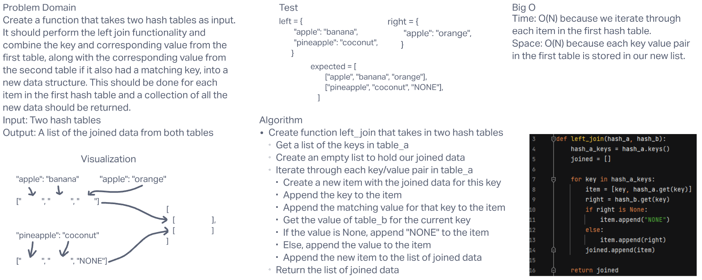

# **Challenge Summary**

This challenge required us to create a function that takes two hash tables as input. It should perform the left join functionality and combine the key and corresponding value from the first table, along with the corresponding value from the second table if it also had a matching key, into a new data structure. This should be done for each item in the first hash table and a collection of all the new data should be returned.

## **Whiteboard Process**

## **Approach & Efficiency**

Big O Time: I believe it is O(N) because we have to iterate through every key/value pair in the first hash table. This means time increases in direct proportion to the size of the left hash table.

Big O Space: I believe it is O(N) because every key/value pair in the left hash table is stored in the new list of joined data.
