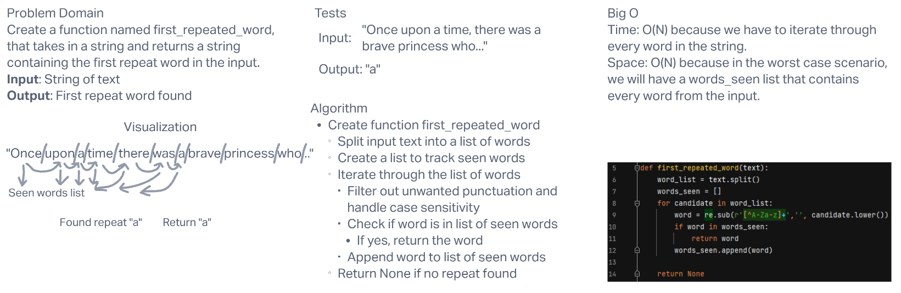

# **Challenge Summary**

This challenge required us to create a function that takes in a string of text and returns a string containing the first repeat word found in the input.

## **Whiteboard Process**

## **Approach & Efficiency**

Big O Time: I believe it is O(N) because we have to iterate through every word in the string. This means that time increases in direct proportion to the size of the input.

Big O Space: I believe it is O(N) because in the worst case scenario, we will have a `words_seen` list that contains every word from the input. This means that storage space increases in direct proportion to the size of the input.
