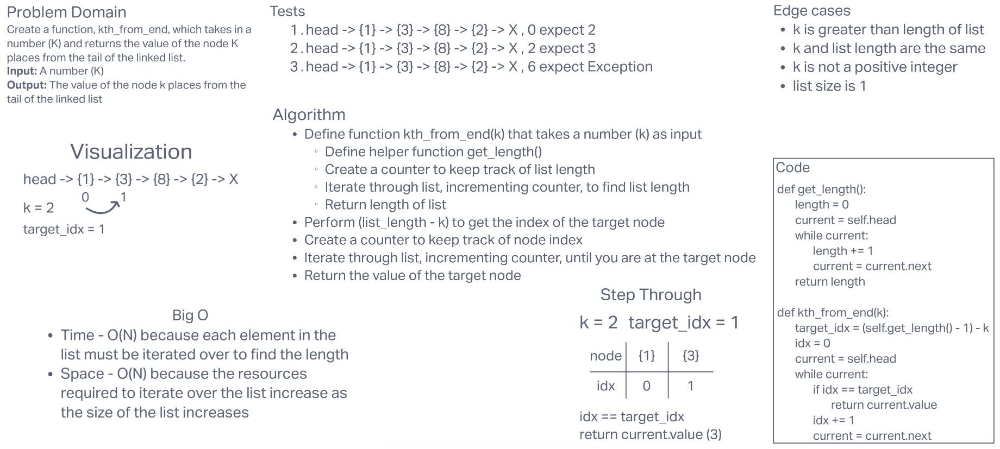

# **Challenge Summary**

This challenge required us to expand on the functionality of our Singly Linked List. Our linked list must have a method named `kth_from_end` that takes a number input `k` and returns the value of the node `k` places from the tail of the linked list.

## **Whiteboard Process**

## **Approach & Efficiency**

I originally wanted to just count backwards from the end of the list, but how do you do that with a linked list? I decided instead it would just be better to count from the front like normal using the information we were given. If you know how far an item is from one end and you know how long the list is, then you can find how far that item is from the other end as well.

Big O Time: I believe it is BigO(N) for this function because each element in the list must be iterated over to find the length. In the worst case scenario, every element will also need to be iterated over to arrive at the target index. So as the list grows in size, the required time will grow with it.

Big O Space: I believe it is a BigO(N) for this function because the resources required to iterate over every item in the list increase as the size of the list increases.
