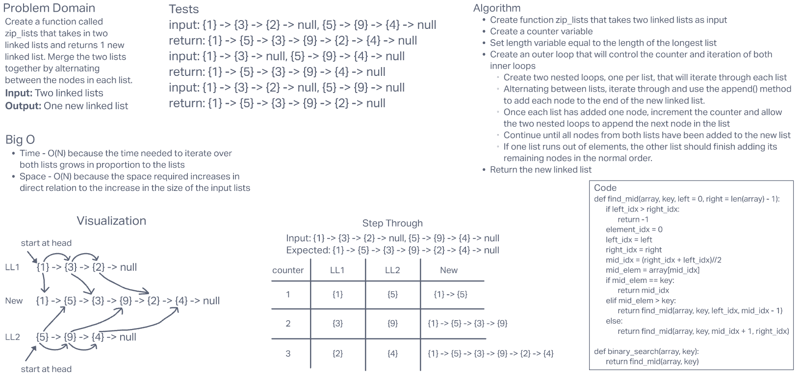

# **Challenge Summary**

This challenge required us to create a function called zip_lists that takes in two linked lists and returns one new linked list. Merge the two lists together by adding each node to the new list, alternating between the nodes in each list.

## **Whiteboard Process**

## **Approach & Efficiency**

I thought it would be best to use the existing `append()` function to add new nodes to the end of the new list. I wanted to try to create the new list using a single loop and ended up using some nested loops to do it.

Big O Time: I believe it is BigO(N) for this function because the time needed to iterate over both lists grows in proportion to the lists.

Big O Space: I believe it is a BigO(N) for this function because the space required increases in direct relation to the increase in the size of the input lists.
