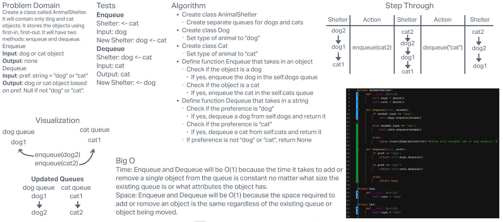

# **Challenge Summary**

This challenge required us to create a class named AnimalShelter. It must contain only dog and cat objects and store those objects using first-in, first-out (FIFO). It must have two methods: enqueue and dequeue.

## **Whiteboard Process**

