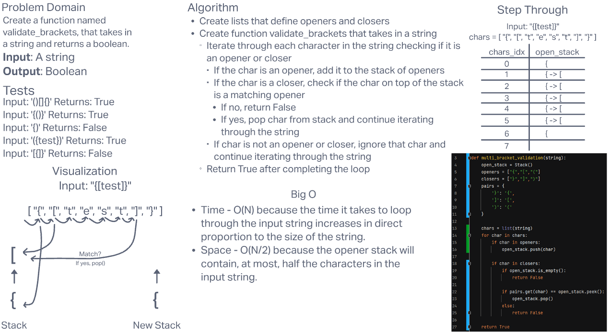

# **Challenge Summary**

This challenge required us to create a function that will validate whether the brackets in a string are balanced. It will take in a string and return a boolean value.

## **Whiteboard Process**

