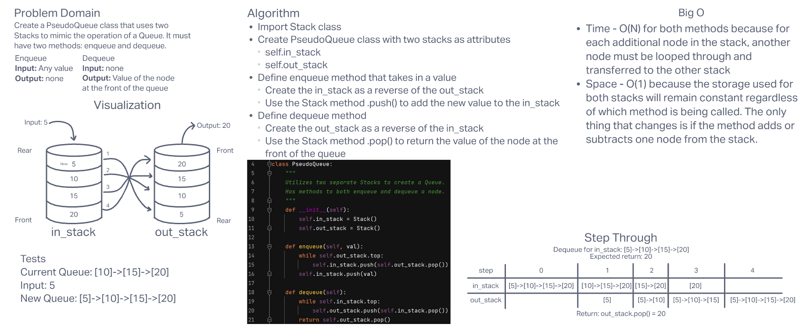

# **Challenge Summary**

This challenge required us to create a PseudoQueue class with two methods: enqueue and dequeue. It needs to mimic the functionality of a Queue using two Stacks. We can import and use our Stack class from the challenge on Friday.

## **Whiteboard Process**

