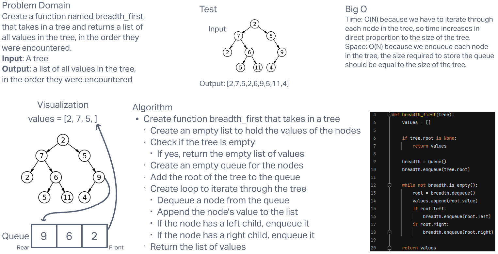

# **Challenge Summary**

This challenge required us to create a function called breadth_first that takes in a tree and returns a list of  all values in the tree, in the order they were encountered.

## **Whiteboard Process**

