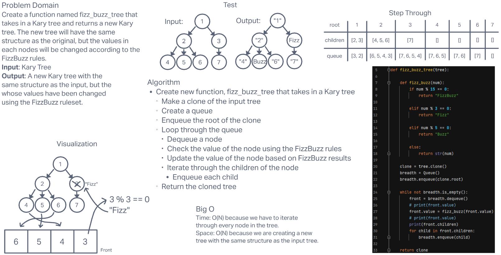

# **Challenge Summary**

This challenge required us to create a function named fizz_buzz_tree that takes in a kary tree and returns a new kary tree. The structure of the new tree must be the same, but the values in each node should be changed according to the FizzBuzz rules. The input tree must also remain unchanged.

## **Whiteboard Process**

## **Approach and Efficiency**

The solution for this problem uses the breadth-first method we constructed the other day. Building off of this, you can just do something a little different when you walk to each node. In this case, we want to check the value of the node against the FizzBuzz rules and then update its value accordingly. We also have to return a new tree and leave the input unchanged. This required us to also clone the input tree before using a breadth-first search to change its values.

The time complexity for this solution is O(N), because we have to iterate through each node in the tree and update its value. This means that the time required will increase in direct relation to the number of nodes in the tree.

The space complexity for this solution is O(N), because we have to create a new tree with the same exact structure as the input tree. This means that the space taken will increase in direct proportion to the size of the input tree.
