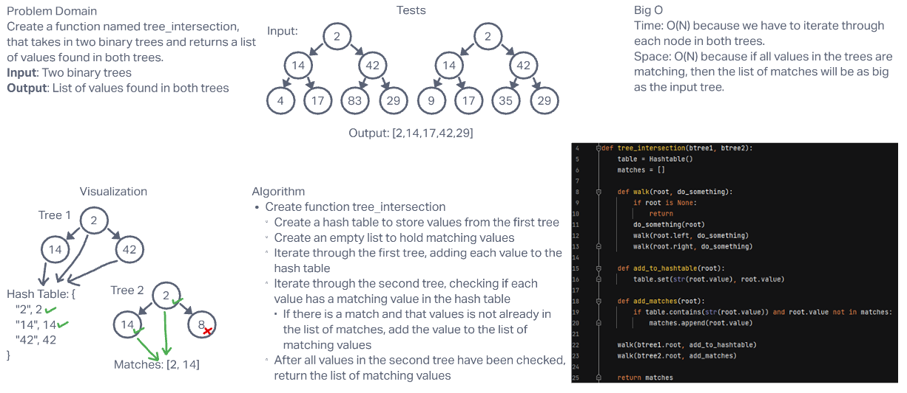

# **Challenge Summary**

This challenge required us to create a function that takes two Binary Trees as input and returns a list of values that were found in both trees.

## **Whiteboard Process**

## **Approach & Efficiency**

Big O Time: I believe it is O(N) because we have to iterate through each node in both trees.

Big O Space: I believe it is O(N) because if every value in the trees are matching, then the list of matches will be as big as the input tree.
