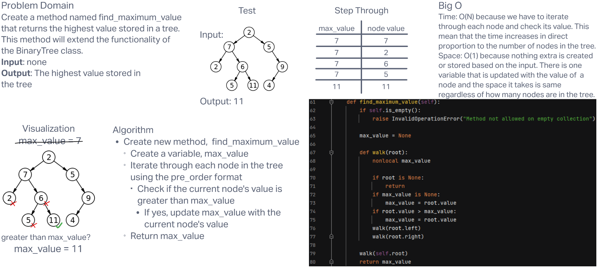

# **Challenge Summary**

This challenge required us to extend the functionality of our BinaryTree class. We had to create a method called find_maximum_value that returns the highest value stored in the tree.

## **Whiteboard Process**

## **Approach and Efficiency**

The solution for this problem is similar to the ordering methods we had to create when originally making the BinaryTree class. I used pre-order to iterate through the tree, but you could also use in-order, post-order, or breadth-first. However you do it, you just need to check every node in the tree and keep track of the highest value.

The time complexity for this solution is O(N), because we have to iterate through each node and check its value. This means that the time required will increase in direct relation to the number of nodes in the tree.

The space complexity for this solution is O(1), because nothing extra is stored or created because of the input. The only thing we store is the max_value variable, which takes up basically the same amount of space regardless of what value it stores. This means that are space taken is not related to the size of the tree at all.
