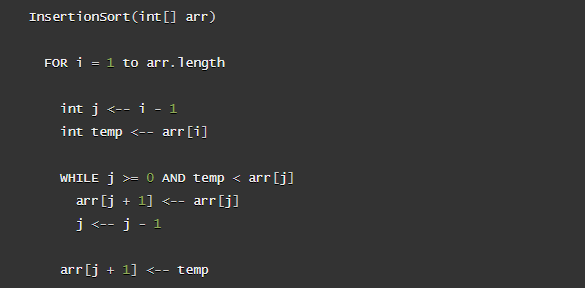
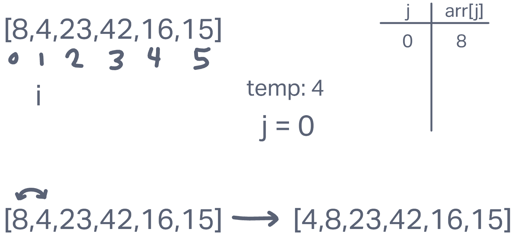
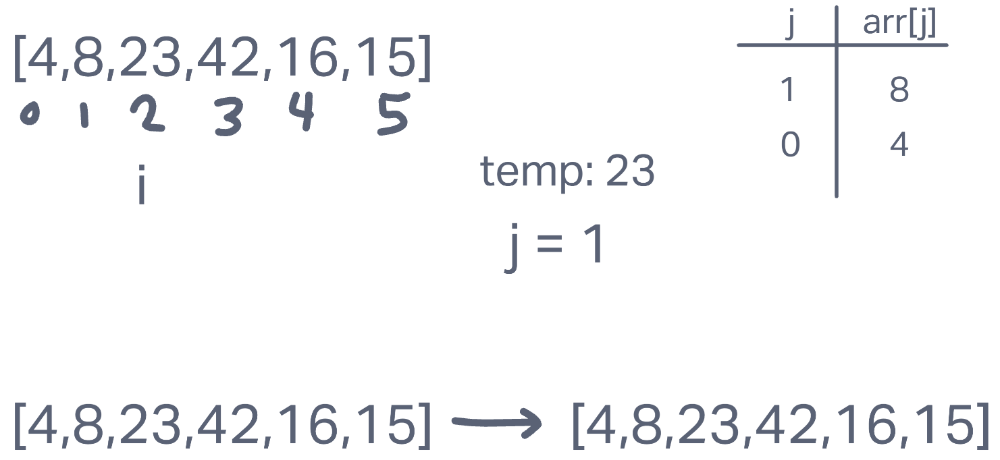
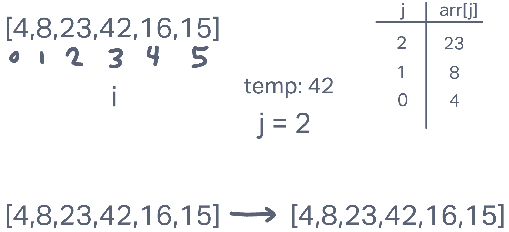
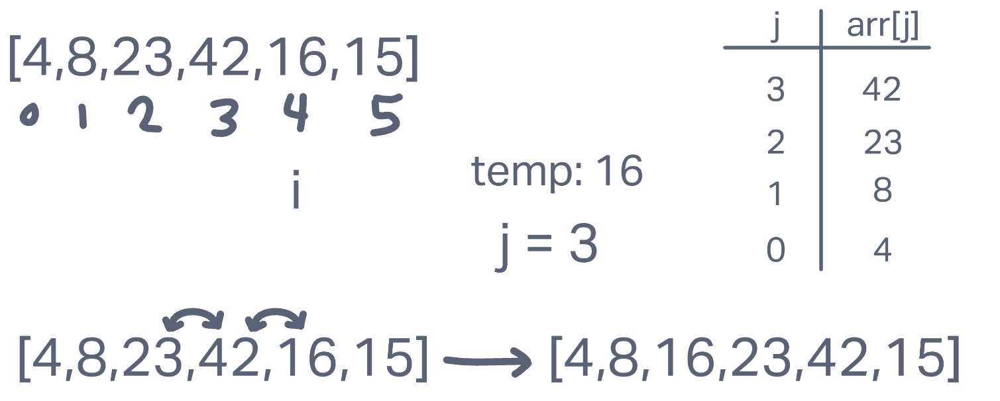
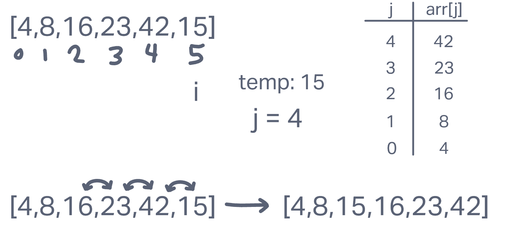

# **Insertion Sort**

Insertion Sort is a sorting algorithm that uses a nested loop to iterate through a list and sort its values. It uses a `temp` variable to store the current value and compare it with previous values in the list. It effectively shifts the values up the list if they are greater than the `temp` value. After iterating through the list and performing this comparison for each value, the list will be properly ordered.

## **Pseudocode**

## **Trace**

Array: `[8,4,23,42,16,15]`

### Step 0

There is technically a step 0, where j is not a valid number, so we do not compare or change any values. We then continue iterating through the list at Step 1.

### Step 1

In the first step through the list, `i` is 1 making `j` equal 0. We set `temp` equal to the value of the list at index `i`. Then, we compare the value of the list at index `j` to `temp`. Since `temp` is less than `list[j]`, we update the value of `list[j+1]` to equal the value of `list[j]`. Then we decrement `j` by 1 and continue to compare `list[j]` to `temp` until `j` is less than 0. In this case, `j` started at 0 and is now at -1 after the first comparison, which means we are done with the comparison loop. We finish by setting `list[j+1]` equal to `temp`, which means that in this case we have effectively swapped the position of 8 and 4 in the list.

### Step 2

In step 2, `i` and `j` have both been incremented by 1, so `temp` is now 23. We start the comparison loop again and see that this time, `temp` is greater than `list[j]`. This means we don't change any values or decrement `j` and continue the loop. Instead we are immediately done with the loop and finish by setting `list[j+1]` equal to `temp`. In this case, `list[j+1]` equals `i`, which means we are setting the reference point for `temp` equal to `temp`. In simpler words, although that line of code must execute, we are not actually changing any values.

### Step 3

Step 3 is pretty much the same as Step 2 in this specific case. Since all of the list values we've looked at so far are in order, the comparison loop will fail and we won't actually make any changes. You can sum it up quickly like this: if `list[i]` is greater than `list[j]`, then there is no change; move to next step.

### Step 4

We get some action again here in Step 4. Since 42 is greater than 16, the comparison is going to work and `list[j+1]`, which is `list[4]` right now, will get reassigned to equal 42. Now we decrement `j` and continue the comparison loop. This time, `j` is 2, which means we will continue comparing `temp` to `list[j]`. Here, 23 is also greater than 16, so again we set `list[j+1]` equal to `arr[j]`. We decrement `j` to 1 and re-evaluate again. This time `list[j]` is 8, which is less than `temp`. This means we are done with the comparison loop now and finish by setting `arr[j+1]` equal to `temp`. So in this step, we effectively shifted 16 down two places in the list.

### Step 5

In this final step, we are in a similar situation as Step 4. `list[j]` is greater than `temp`, so we shift 42 up one index value. We decrement `j` and do the same thing again with 23. Now we have decremented `j` another time, making it equal to 2, and we compare `temp` to `list[j]` again. Now `list[j]` is 16, which is still greater than `temp`, so we set `list[j+1]` equal to `list[j]` again. Now `j` is 1 and `list[j]` is less than `temp`, so we are finished with the comparison loop. We finish off the whole process by setting `list[j+1]` equal to `temp` and now our list is in order.
