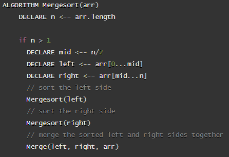
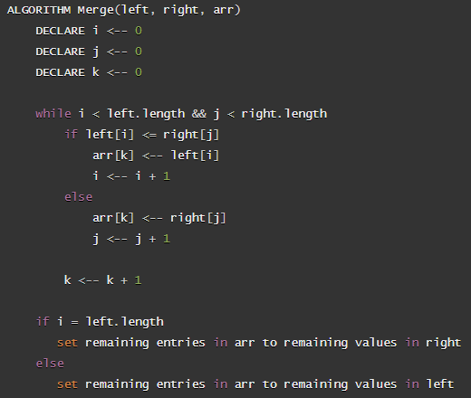
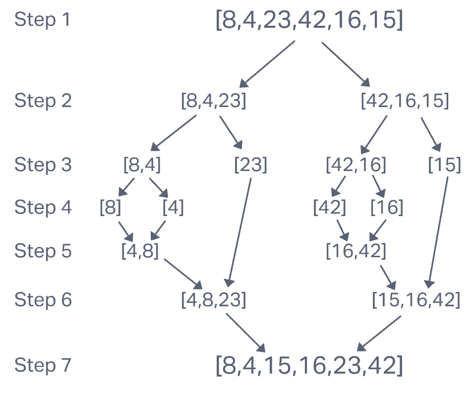

# **Merge Sort**

Merge Sort is an algorithm that sorts a list of values by splitting the given list in half and then recursively calling itself to do it again. It continues to split until each half of the list contains only one value, at which point the recursive calls are done and the stack begins to resolve. The values are then actually sorted by the merge function, which compares values and merges them together into one array in ascending order of values.

## **Pseudocode**

### Merge Sort

### Merge

## **Trace**

Let's step through an example for the given list: `[8,4,23,42,16,15]`

### Step 1

In the first step, we start by calling `merge_sort` on the whole list. Our list gets divided into two new lists, `left` and `right`. Next, `merge_sort` recursively calls itself and passes in our new `left` list. Then, another recursive call of `merge_sort` is made passing in `right`. Keep in mind that because of the order in which the recursive calls are made, the left half of the tree resolves before the right half.

### Step 2

In step 2, we divide our list `left` into new `left` and `right` lists. Then we make another recursive call using `left` and then `right`. The same happens for `right` when it is resolved on the stack.

### Step 3

Our new `left` is divided one more time into a new `left` and `right`. Another recursive call is made passing in `left` and then `right`. At this point, our `right` list, containing only the value 23, no longer divides or makes recursive calls since it is only a single value now. This same process happens on the right side with the lists `[42,16]` and `[15]`.

### Step 4

In step 4, we can see that every list now contains only a single value. That means we are finished with dividing and making recursive calls. Now, we are going to start resolving the call stack. In `merge_sort`, after both recursive calls are made, the final line calls the `merge` function. This is where the sorting actually takes place. We start adding the values of both lists into one list based on the value of each item in the list. It is really easy with one value in each list. Whichever value is lower gets added first and then the other one is added to the list.

### Step 5

Here we have one list of two values and the other only has one. This is where we start to actually sort through some values. We iterate through each value in both lists and compare them. In this case, 4 is less than 23, so 4 is added to the list. Next, we compare 8 and 23. Since 8 is smaller, it is added to the list. Now, one list is out of values, so we just add the remaining values in the other list to the end of our new list. This means that 23 just gets tacked on the end regardless of its value. This whole process happens for `[16,42]` and `[15]` when it gets resolved on the stack.

### Step 6

In this step, we loop through two list that both contain multiple values. Again, we iterate through both lists, comparing their values to each other. We start by adding 4 to the new list, because it is less than 15. Next, we see that 8 is also less than 15, so we add 8 to the list. Now 23 is larger than 15, so 15 gets added. 23 is also larger than 16, so add 16 to the list. 23 is less than 42, so we add 23 to the list and now our left list is out of values. This means we just add 42 onto the end of the list. If there were more values in the right list, they would also get added onto the end of the list.

### Step 7

We have finished resolving the call stack and have our completed list. This new list contains all of the values from our starting list, but they are now sorted in ascending order. At this point, our function returns this new sorted list and we're done!
